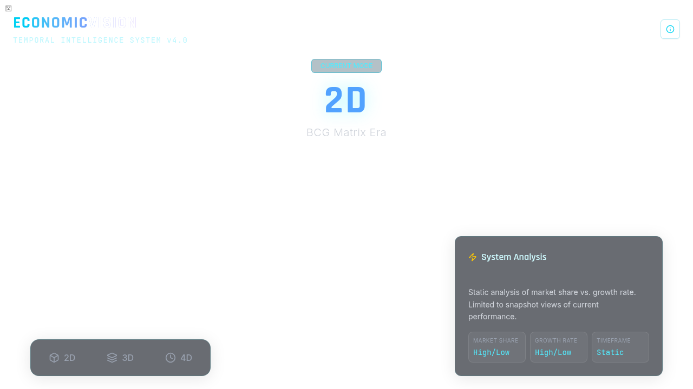

# 4D Economic Visualization System

A high-fidelity, interactive 3D/4D visualization tool built with React, Three.js, and React Spring. This project visualizes the evolution of economic strategy models from traditional 2D matrices to advanced 4D temporal intelligence systems.



## 🚀 Features

*   **Interactive 3D Graphics:** Real-time rendering using `@react-three/fiber` and `@react-three/drei`.
*   **Smooth Transitions:** Fluid animations between dimensions (2D -> 3D -> 4D) powered by `@react-spring/three`.
*   **Professional Terminology:** Modernized business strategy labels (Market Leaders, Core Assets, Emerging Ventures, Underperformers).
*   **Multiple View Modes:**
    *   **2D Mode:** Classic BCG Matrix visualization.
    *   **3D Mode:** Expansion cube representing strategic transition.
    *   **4D Mode:** Tesseract hypercube representing temporal intelligence.
    *   **Overview Mode:** Composite view displaying all stages side-by-side.
*   **Holographic Aesthetic:** Cyberpunk-inspired design with glassmorphism, neon accents, and deep space backgrounds.

## 🛠️ Tech Stack

*   **Framework:** [React 19](https://react.dev/)
*   **Build Tool:** [Vite](https://vitejs.dev/)
*   **3D Engine:** [Three.js](https://threejs.org/)
*   **React 3D Bindings:** [@react-three/fiber](https://docs.pmndrs.assets/react-three-fiber)
*   **Animation:** [@react-spring/three](https://www.react-spring.dev/)
*   **Styling:** [Tailwind CSS 4](https://tailwindcss.com/)
*   **UI Components:** [shadcn/ui](https://ui.shadcn.com/)

## 📦 Installation

1.  **Clone the repository:**
    ```bash
    git clone https://github.com/yourusername/4d-economic-visualization.git
    cd 4d-economic-visualization
    ```

2.  **Install dependencies:**
    ```bash
    pnpm install
    # or
    npm install
    # or
    yarn install
    ```

3.  **Start the development server:**
    ```bash
    pnpm dev
    ```
    Open `http://localhost:3000` in your browser.

## 🏗️ Building for Production

To create a production-ready build:

```bash
pnpm build
```

The output will be in the `dist` directory, ready to be deployed to any static hosting provider (Vercel, Netlify, GitHub Pages, etc.).

## 📂 Project Structure

```
client/
  src/
    components/
      Visualization3D.tsx  # Core 3D logic and animation components
    pages/
      Home.tsx             # Main UI layout and controls
    index.css              # Global styles and Tailwind configuration
```

## 🎨 Customization

*   **Labels:** Edit `Visualization3D.tsx` to change the text labels for the matrix quadrants or 3D elements.
*   **Colors:** Modify the `index.css` file to update the CSS variables for the theme colors.
*   **Animations:** Adjust the `useSpring` config in `Visualization3D.tsx` to change animation timing and physics.

## 📄 License

MIT
